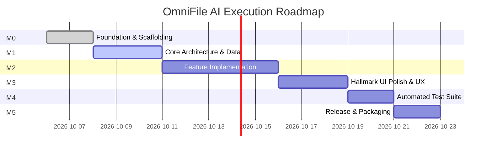

# 08. Milestones & Implementation Roadmap — OmniFile AI 🗺️

Dokumen ini memetakan tahapan fase pengembangan (*Phased Execution*), rincian deliverable setiap milestone, serta kriteria *Definition of Done (DoD)* untuk **OmniFile AI**.

---

## 📅 Phased Execution Roadmap

---

## 🎯 Rincian Milestone & Deliverables

### Milestone 0: Foundation & Workflows (M0)
- Inisialisasi struktur direktori, repositori Git, dan file memori (`progress.md`, `AGENT_NOTICE.md`).
- Penyusunan rangkaian dokumen panduan lengkap di `workflows/`.
- Verifikasi lingkungan pengembangan dan paket dependensi dasar.

### Milestone 1: Core Architecture & Data Models (M1)
- Pembuatan skema basis data / relasi entitas di `workflows/04_data_models.md`.
- Implementasi repositori data, singleton storage, dan migrasi awal.
- Setup skrip verifikasi non-interaktif.

### Milestone 2: Feature Implementation (M2)
- Implementasi logika bisnis utama sesuai `workflows/01_requirements.md`.
- Penanganan error terstruktur, validasi input, dan mekanisme rollback.
- Pencatatan keputusan arsitektural secara berkala di `progress.md`.

### Milestone 3: Hallmark UI Polish & UX (M3)
- Implementasi antarmuka pengguna mengadopsi `workflows/06_ui_design_system.md`.
- Integrasi ikon Material Symbols Outlined dan CSS Custom Properties.
- Dukungan interaksi responsif, micro-animations, dan state loading/error.

### Milestone 4: Automated Testing & Quality Gates (M4)
- Penulisan unit tests dan integration tests untuk menguji modul kritis.
- Verifikasi skenario error (boundary testing, edge cases).
- Memastikan 100% test lulus pada lingkungan lokal.

### Milestone 5: Packaging & Release (M5)
- Pengemasan aplikasi (bundle, executable, atau deployment build).
- Pembaruan dokumentasi `README.md` dan checklist rilis akhir.

---

## ✅ Definition of Done (DoD)

Sebuah fitur atau milestone dinyatakan **DONE** hanya jika:
1. **Kode Teruji**: Lolos automated test atau verifikasi fungsional lokal tanpa error tersembunyi.
2. **Kepatuhan Desain**: Antarmuka mematuhi standar Hallmark UI tanpa ada elemen AI-slop atau kontrol dummy.
3. **Memori Sesi Tercatat**: Seluruh tindakan, perubahan file, dan keputusan arsitektur telah didokumentasikan di `progress.md`.
4. **Git Bersih**: Perubahan ter-commit dengan pesan deskriptif mengikuti format standar (`feat(...)`, `fix(...)`, `docs(...)`).
